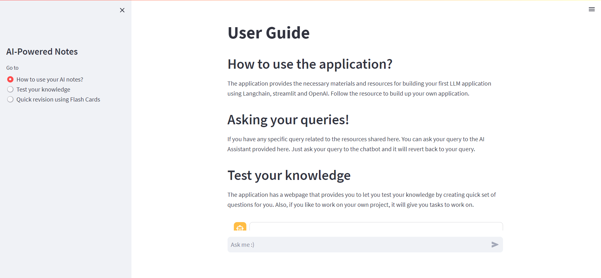

# Educhain
Educhain is the new adaptive, responsive and engaging books. Unlike the old customary books, it lets the user engage with the book. Ask certain doubts and experience learning at a next level.


### How to use the app
1. Clone the app 
2. Enter in the command in the terminal ```streamlit run app.py```


### Demo 
